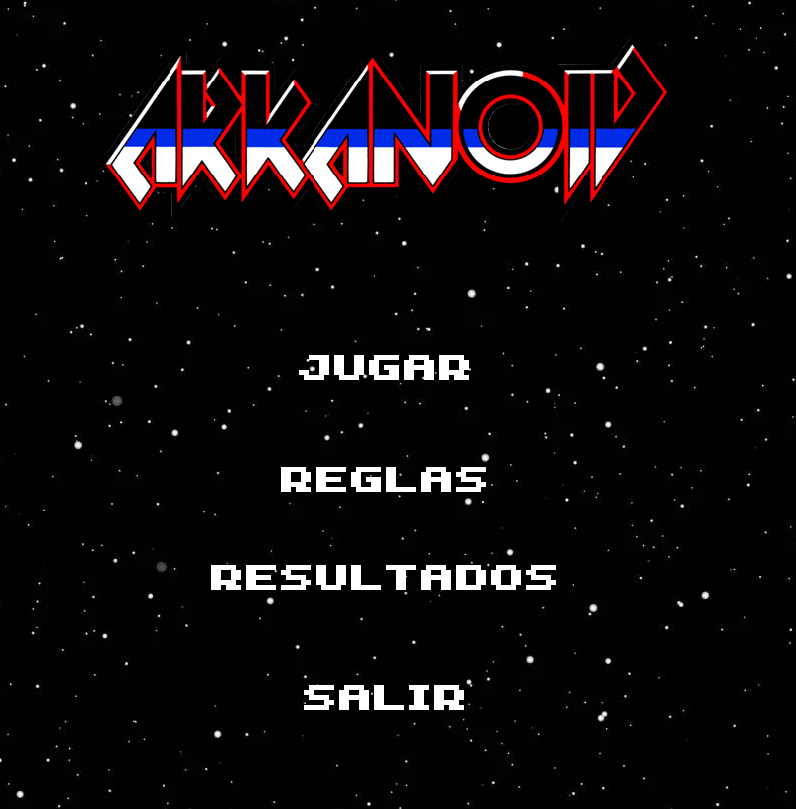
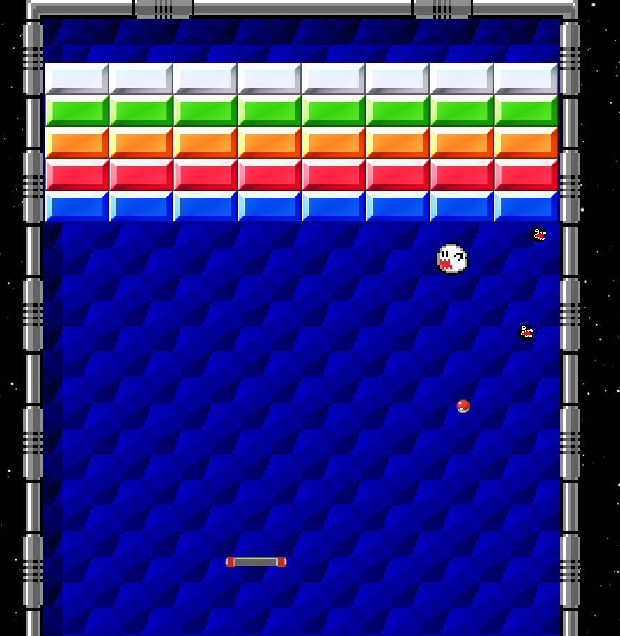
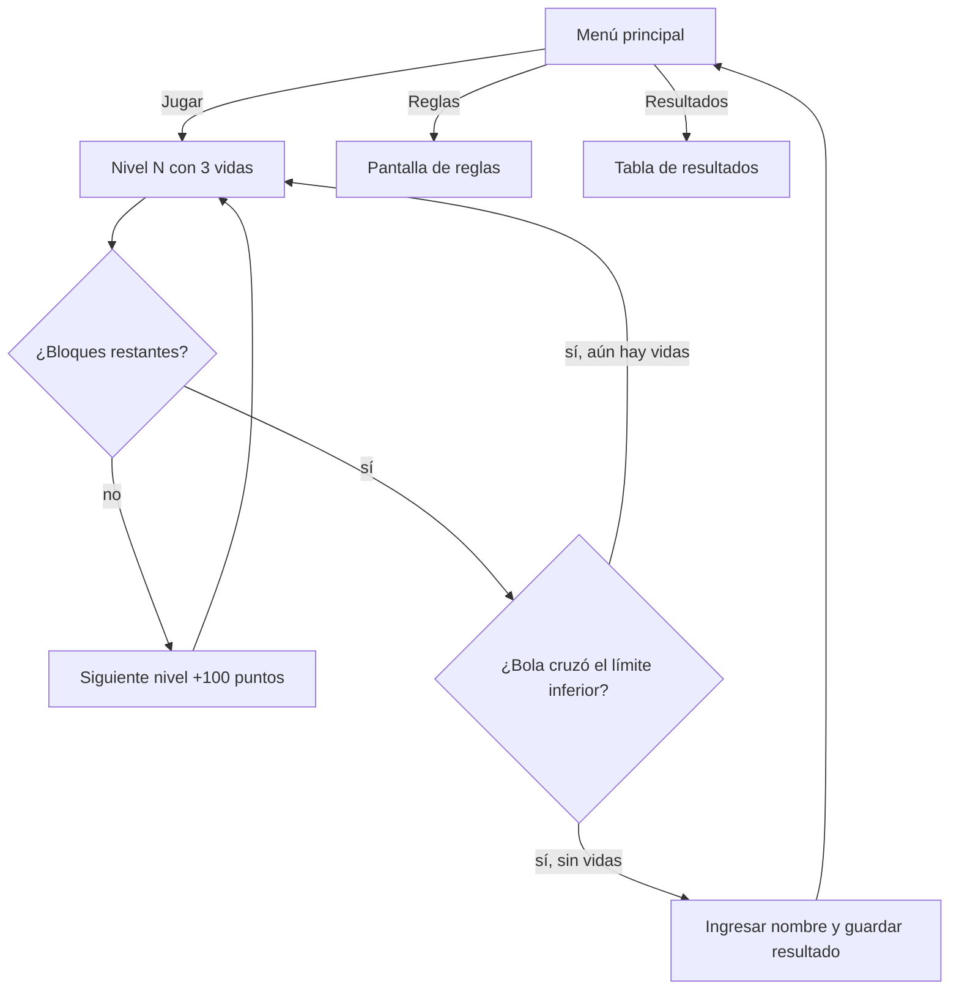

# Arkanoid ED

Recreación del clásico videojuego Arkanoid en C++ con la biblioteca gráfica Allegro 5, hecha para el curso de Estructuras de Datos. Controlas una nave en la parte inferior, rebotas una bola para destruir bloques de colores, esquivas enemigos y avanzas por 10 niveles con 3 vidas.

<p align="center">
  
  
</p>

<p align="center">
  
  
  
</p>

---

## Tabla de Contenidos
- [Features](#features)
- [Autores](#autores)
- [Cómo se Juega](#cómo-se-juega)
- [Flujo de Juego](#flujo-de-juego)
- [Tecnologías](#tecnologías)
- [Estructura del Proyecto](#estructura-del-proyecto)
- [Ejecucion](#ejecucion)
- [Documentación](#documentación)
- [Conocimientos Adquiridos](#conocimientos-adquiridos)

---

## Features
* Menú principal controlado con el mouse: **Jugar**, **Reglas**, **Resultados** y **Salir**, con resaltado al pasar el cursor.
* 10 niveles con formaciones de bloques distintas; los bloques tienen resistencia aleatoria de 1 a 5 golpes.
* Enemigos que aparecen durante la partida y se mueven con velocidad y dirección aleatorias.
* Sistema de 3 vidas, puntaje y contadores de bloques y enemigos eliminados en pantalla.
* Tabla de **Resultados** con scroll, guardada en un archivo de texto (`resultados.txt`).
* Música de fondo y efectos de sonido (rebotes, puntos, cambio de nivel y fin del juego).
* Pantalla completa adaptada a la resolución del monitor.

---

## Autores
* Christopher Daniel Vargas Villalta, 2024108443
* Santiago Espinoza Rendón

**Curso:** Estructuras de Datos (Grupo 3)

**Profesor:** Víctor Manuel Garro Abarca

---

## Cómo se Juega

| Control | Acción |
|---------|--------|
| Flecha izquierda / derecha | Mover la nave |
| Mouse | Navegar el menú |
| Esc | Salir |

* La partida empieza al mover la nave por primera vez.
* Avanzas de nivel al destruir todos los bloques; pierdes una vida si la bola cruza el límite inferior.
* Al perder las 3 vidas escribes tu nombre y el resultado se guarda en la tabla de **Resultados**.

| Evento | Puntos |
|--------|--------|
| Bloque destruido | 5 |
| Enemigo eliminado | 10 |
| Nivel completado | 100 |

---

## Flujos de Juego
Programa en C++ basado en eventos con un ciclo principal a 60 FPS. El menú (`Arkanoid.cpp`) lanza el juego (`Juego.h`), que usa las funciones de lógica de `FuncionesJuego.h`.



**Estructuras de datos utilizadas**
* **Cola de eventos de Allegro** para manejar el teclado, el mouse, los timers y los cambios de pantalla.
* **Listas enlazadas** con punteros (`Siguiente`) para los bloques, los enemigos y la bola, con asignación y liberación dinámica de memoria.
* **Estructuras (`struct`)** para la nave, la bola, los bloques y los enemigos.
* **Archivo de texto** para guardar y cargar los resultados de los jugadores.

---

## Tecnologías
* C++ con Visual Studio 2022 (toolset v143, Windows).
* [Allegro 5.2.9](https://liballeg.org/) y AllegroDeps 1.14.0 (gráficos, imágenes, fuentes TTF, audio y entrada), instalados con NuGet.

---

## Estructura del Proyecto
```text
Arkanoid-ED/
├── docs/
│   ├── Anteproyecto-1A-1B.pdf   # Plan de desarrollo del proyecto
│   ├── menu-principal.png       # Captura del menú
│   └── juego.png                # Captura de una partida
├── Proyecto 1A/
│   ├── Proyecto 1A Arkanoid.sln # Solución de Visual Studio
│   └── Proyecto 1A/
│       ├── Arkanoid.cpp         # main y menú principal
│       ├── Juego.h              # Ciclo principal del juego
│       ├── FuncionesJuego.h     # Structs, colisiones, enemigos, niveles y resultados
│       ├── Imagenes/            # Sprites, bloques y fondos
│       ├── Sonidos/             # Música y efectos
│       ├── Video-Font.TTF       # Fuente del juego
│       └── resultados.txt       # Tabla de resultados
└── README.md
```

---

## Ejecucion

### Requisitos previos
* Windows con **Visual Studio 2022** y el componente *Desarrollo para el escritorio con C++*.
* Conexión a internet la primera vez para restaurar los paquetes NuGet de Allegro.

### Inicio rápido
1. Clonar el repositorio y abrir `Proyecto 1A/Proyecto 1A Arkanoid.sln` en Visual Studio.
2. Restaurar los paquetes NuGet (Visual Studio lo hace al compilar; si no, clic derecho en la solución → *Restaurar paquetes NuGet*).
3. Elegir la configuración **x64** (Debug o Release).
4. Ejecutar con **F5**.

### Notas
* Ejecutar desde Visual Studio: el juego carga `Imagenes/`, `Sonidos/`, `Video-Font.TTF` y `resultados.txt` desde el directorio del proyecto (`Proyecto 1A/Proyecto 1A`), que es el directorio de trabajo por defecto de Visual Studio. Si se ejecuta el `.exe` directamente, debe tener esas carpetas junto a él.
* El juego abre en pantalla completa; usar **Esc** para salir.

---

## Documentación
* [Anteproyecto 1A y 1B (PDF)](docs/Anteproyecto-1A-1B.pdf) – plan de desarrollo, subrutinas, algoritmos, interfaz y cronograma, entregado el 19 de septiembre de 2024.
  * **Proyecto 1A:** Arkanoid (este repositorio).

---

## Conocimientos Adquiridos
* A usar memoria dinámica y listas enlazadas con punteros para manejar elementos del juego que aparecen y desaparecen (bloques, enemigos, bola) y a liberarla correctamente.
* A trabajar con programación orientada a eventos: cola de eventos, timers y teclado/mouse en una biblioteca gráfica como Allegro.
